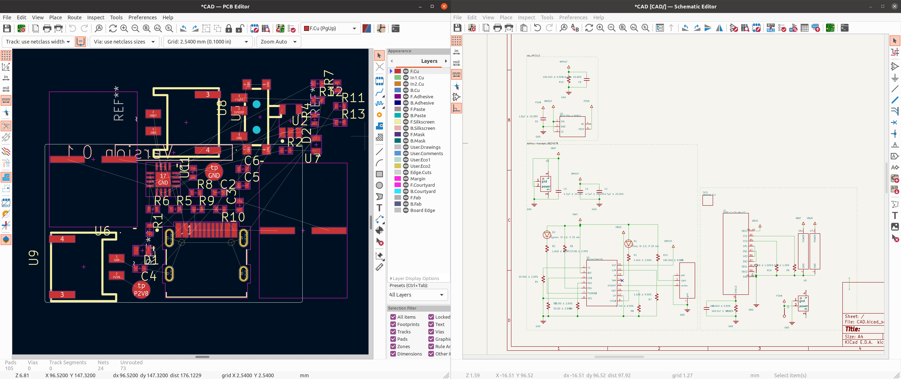

# Battery Charger PSU Cookbook Recipe

This tutorial guides you in creating a Lithium Polymer Battery Charging Board in JITX from the ground up. With step-by-step instructions, even individuals with no prior experience in JITX can learn to define hardware in software and generate a PCB using code.

### Picture of the final design:


### Resources

This board is fully open source, and available here: [Battery Charger Board JITX Recipe](https://github.com/JITx-Inc/jitx-cookbook/tree/main/battery_charger_design)

Clone this repo and open it in VSCode to follow along.

### Intended functionality

Let's start by considering what we want our design to be able to do:

- charge a 3.7V lithium polymer battery from a USB cable
- safely stop charging the battery once it's full
- an indicator to tell us when the battery is charging
- provide an output voltage of 2.8V from either the battery or the USB cable. If the USB is plugged in, we want it to charge the battery while also providing the output voltage

### Implementation plan

To accomplish the above, we need a few components:

- a lithium battery charger IC, let's use the Texas Instruments [BQ2407x](https://www.ti.com/lit/ds/symlink/bq24076.pdf?HQS=dis-mous-null-mousermode-dsf-pf-null-wwe&ts=1674500300089&ref_url=https%253A%252F%252Fwww.mouser.com%252F)
- a USB-C connector
- some connectors for the battery and voltage out
- a switch to turn things on and off
- some LEDs for the status indicator
- a voltage regulator to provide our 2.8V out, let's use the Diodes Inc [AP2125](https://www.digikey.com/en/products/detail/diodes-incorporated/AP2125K-2-8TRG1/4470776)

### Getting started

To start, we'll need to setup JITX. We can follow this tutorial to get setup: https://docs-testing.jitx.com/faq/installationinstructions.html

Then, we need to create a new project. So let's run VSCode, select the JITX extension, and click "New Project".

Now we're ready to start designing the board.

NOTE: The code below is not the entire design. Refer to the [Github repo](https://github.com/JITx-Inc/jitx-cookbook/tree/main/battery_charger_design) for a full working design. Below, we describe the design flow and thought process behind designing this battery charger board.

### Components

We've identified some specific components that we want to use, namely the [BQ2407x](https://www.ti.com/lit/ds/symlink/bq24076.pdf?HQS=dis-mous-null-mousermode-dsf-pf-null-wwe&ts=1674500300089&ref_url=https%253A%252F%252Fwww.mouser.com%252F) and the [AP2125](https://www.digikey.com/en/products/detail/diodes-incorporated/AP2125K-2-8TRG1/4470776), alongside some other generic components.

JITX has built-in support for many basic components like capacitors, resistors, and LED's, so we'll be able to source those as we need them while designing. For the specific ICs we're using, we'll need to either find an existing component definition, or make that ourselves. For this tutorial, let's just make the component definitions ourselves.

#### Battery Charger Component

We'll be using the BQ2407x lithium battery charger module:

[BQ2407x Datasheet](https://www.ti.com/lit/ds/symlink/bq24076.pdf?HQS=dis-mous-null-mousermode-dsf-pf-null-wwe&ts=1674500300089&ref_url=https%253A%252F%252Fwww.mouser.com%252F)


###### Making a new component
The first thing we'll do is go to the JITX VSCode extension and click "New Component". Let's make a new directory, called `components`, where we can save all of our components.

Now that we've created the directory, JITX is asking for the name of the new component, let's call it `BQ24078RGTR`, which we've copied directly from the datasheet.

We now have a new component started, but it doesn't have any information defined. Before anything, let's open up the BQ2407x datasheet in our browser so we have the information available as we implement the component in JITX: [BQ2407x Datasheet](https://www.ti.com/lit/ds/symlink/bq24076.pdf?HQS=dis-mous-null-mousermode-dsf-pf-null-wwe&ts=1674500300089&ref_url=https%253A%252F%252Fwww.mouser.com%252F)

###### What is the purpose of this code?

Let's take a look at the new file that has been made under `components/BQ24078RGTR.stanza`. We can see it has various information, including name, description, MPN, reference prefix, symbol, and footprint.

This information provides a description of the component under development. At the top of the file, we have regular imports that allow us to use JITX in Stanza. Further down, the `pcb-component` is the actual component that we're making. The `pcb-landpattern` is the landpattern (the footprint) of the component. Within the `pcb-component`, we have a table called pin-properties, which describes all of the pins of our component.

###### Filling out component values

Let's start by filling out information about the component itself. We can change the name, description, mpn, manufacturer, and reference-prefix to the information that makes sense for our component.

```
  name = "BQ24078RGTR"
  description = "Charger IC Lithium Ion 16-VQFN (3x3)"
  mpn = "BQ24078RGTR"
  manufacturer = "TI"
  reference-prefix = "U"
```

###### Assigning a footprint

We can inspect the line that says `assign-landpattern`. This is where the component's footprint is assigned. We can see that `lp-test-comp` is assigned by default. If we scroll up to the `lp-test-comp` landpattern, we can see that we're generating an SOIC footprint with the `make-n-pin-soic-landpattern` function. Looking at our datasheet, the BQ2407 uses a QFN footprint, so let's change the footprint to that.

In order to learn how to generate a QFN landpattern, let's move over to the docs here: https://docs.jitx.com.

We can then use the search bar and look up something about what we're trying to do, like **"make a qfn"**. In the search results, there is a reference to the `make-qfn-landpattern` function which looks like the QFN counterpart. We can replace the previous `make-n-pin-soic-landpattern` with this new QFN function. Let's also use a slightly modified version of this function to fill in information like the EP. We can find the extended version of the function, with EP, by searching for `make-qfn-landpattern` in [OCDB](https://github.com/JITx-Inc/open-components-database) and looking at the function options.

###### Creating Pins

Now we will define the pins of our component. This essentially maps pin names (which we can take from the datasheet, or make up) to the pads that are define in the footprint that we've assigned.

```
  pin-properties :
    [pin:Ref | pads:Ref ... | side:Dir ]
    [TS      | p[1]         | Left     ]
    [OUT     | p[10] p[11]  | Right    ]
    [ILIM    | p[12]        | Right    ]
    ...
```

###### Custom Properties

Let's also create some custom properties of our component that will help us later on. Let's give our component an LCSC vendor product number and a link to the datasheet:

```
  property(self.LCSC) = "C473396"
  property(self.datasheet) = "https://item.szlcsc.com/191835.html"
```

###### Defining a module

The BQ2407x has some pullups/pulldowns, bypass capacitors, LEDs, and other aspects that are going to be identical in every design. We could just pull in the raw component into our main design and add those there. However, to make this reusable, let's define a module for our component, so that whenever a main design imports that module, the basic setup has already been done.

To do so, let's add a line to define our module, define the pins of the mdoule we want to expose, and to instantiate the BQ2407 component in our module:

```
public pcb-module module :
  port vin
  port vout
  port gnd
  port bat+
  port sysoff

  ; using the component definition from above:
  inst bq : components/BQ24078RGTR/component
```

###### Building the BQ2407 submodule circuit

Now, let's look at the reference design of the BQ2407x in the datasheet and implement the aspects which will be the same in any instantiation (pullups, caps, etc.).

To add a capacitor, we use:
```
cap-strap(vout, gnd, ["capacitance" => 4.7e-6 "min-rated-voltage" => 12.0])
  
```

To add a resistor, we can use: 
```
res-strap(bq.ILIM, gnd, 1.1e3)
```

To specify a no-connect, we use:
```
no-connect(bq.TMR)
```

###### Grouping

After doing that for all of the components, let's group this module in our schematic and layout:
```
schematic-group(self) = BQ24078
layout-group(self) = BQ24078
```

#### AP2125 LDO Component

For the AP2125 LDO component, we follow the exact same workflow as for the BQ2407 above.

[AP2125 Datasheet](https://www.diodes.com/assets/Datasheets/AP2125.pdf)


### Main Design

Now that our components are defined, we can define our design. This step is analogous to designing a schematic, but it's defined in code. We're going to pull in all of our components and connect them together.

First, we'll create the battery manager submodule, and start connecting it:
```
  ; create the battery manager IC, connect it
  inst battery-manager : components/BQ24078RGTR/module
  net BMOUT (battery-manager.vout)
  net (battery-manager.gnd GND)
```

Then, let's create a JST connector for our battery input, and connect that to the battery charger (see the full [Github repo](https://github.com/JITx-Inc/jitx-cookbook/tree/main/battery_charger_design) for this component definition). We will load in a JST connector that we created and placed in the components directory:
```
  ; create battery JST connector, connect it
  inst battery-connector : components/PH2_0-2PWB/component 
  net (battery-connector.gnd GND)
  net (battery-connector.power battery-manager.bat+)
```

We also create a battery component. Importantly, this component won't actually be part of our final layout. The reason we create this is so that there is a voltage source logically defined that JITX can use later when we write checks. See the full [Github repo](https://github.com/JITx-Inc/jitx-cookbook/tree/main/battery_charger_design) for this component definition.
```
  ; create the battery itself
  inst battery : components/LithiumBattery/component(typ(3.7), 500.0) ; (voltage, current)
  net VBAT (battery.POWER battery-manager.bat+)
  net (GND battery.GND)
```

We can then do a very similiar thing to define the USB cable power source, the USB connector itself, and the output power JST.

Let's create a switch that can be used to turn the battery charger IC on and off. We'll pull one pole up, one pole down, and we'll make the common connection to the battery charger IC's SYSOFF pin:

```
  ; create switch and pull up, connect them. Switch pulls SYSOFF down for normal operation, high to disconnect battery
  inst switch-phy : components/MK-12C02-G025/component
  net (GND switch-phy.left switch-phy.gnd) ; switch turns battery-manager on
  net (switch-phy.center battery-manager.sysoff)
  val sys-r = res-strap(switch-phy.right, VBAT, 100.0e3) ; pull-up turns battery monitor off
```

Let's create the LDO, and connect it up to the rest of our circuit:
```
 ; create the LDO and connect it
  inst ldo : components/AP2125K-2_8TRG1/module
  net (BMOUT ldo.vin ldo.ce)
  net (ldo.gnd GND)
  net P2V8 (ldo.vout)
  val ldo-pulldown = res-strap(ldo.ce GND, 100.0e3) ; pull-down on the CE pin disables the LDO when the battery manager is not outputting voltage
```

We want to be able to test our board, so let's add some testpoints to the LDO voltage output:
```
  ; create test pads to test/solder LDO vout
  add-testpoint([vout-connector.power], Testpoint-SMDPad)
  add-testpoint([vout-connector.gnd], Testpoint-SMDPad)
```

To clean up our schematic, we can manually assign what type of symbol we want each net to take on:
```
  ; set symbols of some nets
  symbol(GND) = ocdb/utils/symbols/ground-sym
  symbol(VBAT) = ocdb/utils/symbols/supply-sym
  symbol(VBUS) = ocdb/utils/symbols/supply-sym
  symbol(BMOUT) = ocdb/utils/symbols/supply-sym
  symbol(P2V8) = ocdb/utils/symbols/supply-sym
```

Finally, let's clean up the schematic and layout by grouping together our subsystems:
```
  ; group some components in the schematic and layout to make it easier to read
  schematic-group([sys-r switch-phy battery-connector]) = schematic-group(battery-manager)
  layout-group([sys-r switch-phy battery-connector]) = layout-group(battery-manager)
  schematic-group([ldo ldo-pulldown]) = schematic-group(ldo)
  layout-group([ldo ldo-pulldown]) = layout-group(ldo)
```

Press `Ctrl+Enter`, and we have a fully functional schematic, and a board that is ready to be exported for layout! But first, let's write some checks to assess our board and make that everything works exactly as we'd expect it to.

### Checks

JITX has the ability to write checks for our designs. Before we even design a board, se can specify a number of various checks, like:

- which pins should be connected
- rated temperature of various components
- the input voltage range of a component
- etc.

###### Automated checks
The first step to adding design checking is in activating the built-in checks. Addin the following line at the end of our main design pcb-module:
```
  check-design(self)
```

And adding this line after the setup-board block
```
run-check-on-design(battery-manager-module)
```

tells JITX to run a number of automated checks on our board everytime we compile it.

###### Writing our own checks

We also have the capability to write our own checks to test for whatever we want. Let's add a check to the BQ2407x module to check that VSS and EP are connected, as the datasheet specifies this is a requirement.

First, we write a check that makes sure VSS exists, ensures EP exists, and then checks to make sure they're connected:
```
defn has-pin? (comp:JITXObject, pin-q:String) :
  val t = to-tuple $ for p in pins(comp) filter :
    substring?(to-string(ref(p)), pin-q)
  not empty?(t)

pcb-check bq2407-checks (component:JITXObject):

    #CHECK(
    name =                 "EP Exist check"
    description =          "Check that EP exists "
    condition =            has-pin?(component, "EP"),
    category =             "Component checks"
    subcheck-description =          "Check that the EP pin exists "
    pass-message =         "EP does exist. "
    fail-message =         "EP does not exist"
    locators =             [instance-definition(component)]
    )

    #CHECK(
    name =                 "VSS Exist check"
    description =          "Check that VSS exists "
    condition =            has-pin?(component, "VSS"),
    category =             "Component checks"
    subcheck-description =          "Check that the VSS pin exists "
    pass-message =         "VSS does exist. "
    info-message =         "VSS does not exist"
    locators =             [instance-definition(component)]
    )

    #CHECK(
    name =                 ""
    description =          "Check that EP is connected to GND/VSS"
    condition =            connected?([component.EP, component.VSS]),
    category =             "Connection"
    subcheck-description =          "Check that EP is connected to VSS"
    pass-message =         "EP is connected to VSS"
    fail-message =         "EP is not connected to VSS"
    locators =             [instance-definition(component)]
    )
```

In order to run this check whenever we use the BQ2407x module, we add the following line at the end of our BQ2407x `pcb-module` definition:
```
  check bq2407-checks(bq)
```

Now, everytime we use that module, our checks will make sure that's it's connected properly. Checkout the [Github repo](https://github.com/JITx-Inc/jitx-cookbook/tree/main/battery_charger_design) to see other checks we can use in our designs.


### Export to Kicad

We can export our design to Kicad using a single command that's already defined in our `helpers.stanza` which is included in our default new project.

Go to the bottom of your `main.stanza` and add this line, which will export our board to kicad:
```
export-design() 
```
### Layout
Layout your board exactly as you would normally in Kicad.



### Export from Kicad, order from JLCPCB

Install this plugin in Kicad to choose your components from LCSC and generate your PCB: https://github.com/Bouni/kicad-jlcpcb-tools


Upload your design to JLCPCB and order it:


### Conclusion

We've now successfully designed a PCB using JITX. You can now copy this workflow to design your own systems. To learn more, check out the other recipes in [the JITX Cookbook Recipes repo](https://github.com/JITx-Inc/jitx-cookbook) and read through the [tutorials](https://docs.jitx.com/tutorials/index.html) and [how-to guides](https://docs.jitx.com/howtoguides/index.html) in the JITX docs.
