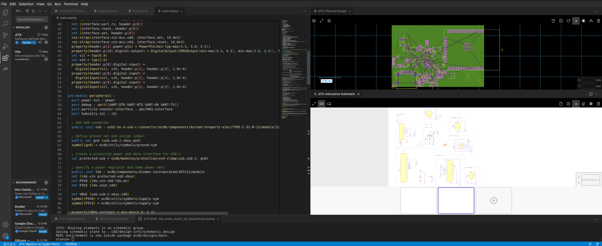
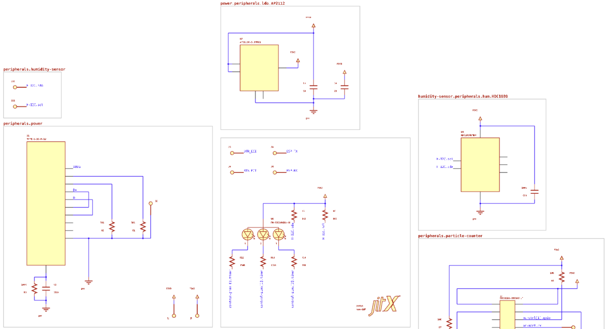
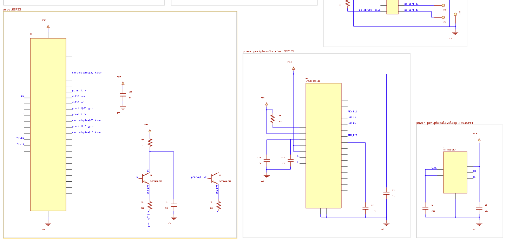
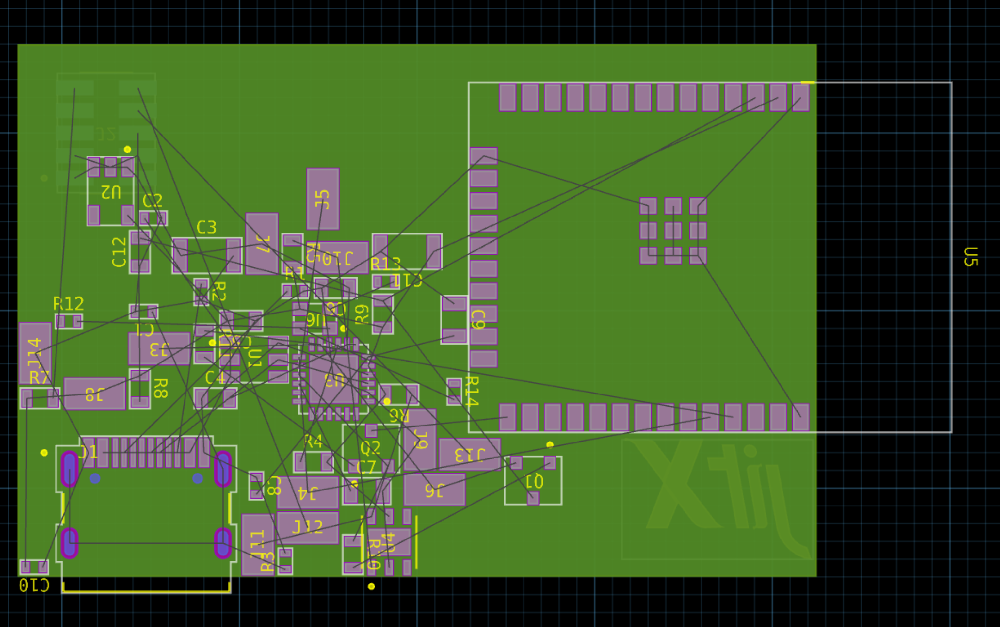

# BLE-mote ESP32 IOT Sensor PCB Cookbook Recipe

We're going to write software-defined hardware with JITX to design an IOT circuit board based on the ESP32 microcontroller. We will discuss the benefits of this approach, including increased speed and reliability, as well as the ease of modifying and updating designs. This article is written for electrical engineers and engineering leaders with experience in traditional EDA CAD tools who want to maximize the productivity of themselves and their team.

## The project

This example design is a Bluetooth + WiFi microcontroller board that is powered over USB, interfaces with an air quality sensor and a humidity sensor, and indicates state with an RGB led.

## Getting started

##### Prerequisites
To start, we'll need to setup JITX. We can follow this tutorial to get setup: https://docs-testing.jitx.com/faq/installationinstructions.html

Then, we need to create a new project. So let's run VSCode, select the JITX extension, and click "New Project".

Now we're ready to start designing the board.

> NOTE: The code below is not the entire design. Refer to the [Github repo](https://github.com/JITx-Inc/jitx-cookbook/tree/main/ble_mote_esp32_iot_board) for a full working design. Below, we describe the design flow and thought process behind designing this board.

##### Intended functionality
We aim to create a circuit board that connects to WiFi and/or Bluetooth and can stream data from a humidity sensor and an air quality sensor. The board should be powered over USB. To indicate its state, the board will have an RGB LED that can change colors based on the data it is receiving.

The board's primary function will be to collect and transmit sensor data wirelessly over a network. With this functionality, the board can be used in various applications, including home automation, indoor air quality monitoring, and smart agriculture. By including a humidity sensor and an air quality sensor, we can create a comprehensive system for measuring and tracking environmental conditions. The board's ability to connect to WiFi or Bluetooth also makes it highly versatile, allowing it to communicate with a range of different devices and networks. 

Overall, our design aims to provide a flexible and reliable solution for monitoring environmental conditions in a variety of settings.

##### Implementation plan

We will use an ESP32-WROOM module to provide wireless connectivity and processing power, and a USB-C connector to provide power to the board. The board will be designed to be as small as possible, to enable it to be used in a variety of applications where space is at a premium. To achieve this goal, we will use JITX's advanced layout tools to optimize the placement of components and minimize the overall area of the board. Additionally, we will need to design the board to be low cost, with a terse bill of materials (BOM) to reduce component costs. This will require careful component selection and an efficient layout to minimize the number of parts required. 

##### Resources

This board is fully open source, available here: [BLE-mote ESP32 IOT Sensor Board](https://github.com/JITx-Inc/jitx-cookbook/tree/main/ble_mote_esp32_iot_board)
Clone [this repo](https://github.com/JITx-Inc/jitx-cookbook), open the subfolder `ble_mote_esp32_iot_board` in VSCode, and build once with `Ctrl+Enter` to follow along.



## Components

Let's choose some of the major components now:

- Microcontroller: ESP32-WROOM32
- Air quality sensor: PMS7003
- USB-C connector: Korean Hroparts Elec TYPE-C-31-M-12
- USB to UART converter: CP2105
- Power regulator LDO: AP2112
- Pin headers: Amphenol Minitek 10-pin female socket
- Humidity sensor: HDC1010

## Main design

#### Configuring parameters

First up, we configure some design parameters that are specific to this design, including the expected range of operating temperature, what we want to optimize for (`"area"` or `"cost"`), and the smallest package that we want to use in our design. These variables are used to guide the component selection algorithms, and are used in automated checking functions.

```stanza
OPERATING-TEMPERATURE = min-max(-20.0 50.0)
OPTIMIZE-FOR = ["cost"]
MIN-PKG = "0402"
MIN-CAP-VOLTAGE = 12.0
```

We also define a shape named `board-outline`. We'll use this later to define the board dimensions.

```
val board-outline = Rectangle(45.0, 30.0)
```

#### Humidity Sensor

PCB modules can be complete PCBs or subcircuits of a larger design. This design contains a one-off interface to the [PMS7003 Air Quality Sensor](https://aqicn.org/sensor/pms5003-7003/). We wrap it up in a `pcb-module` to create an interface with ports and pin properties. These properties enable the schematic checking tool to report if we have connected the pins properly.

```stanza
; PMS7003 particle counter interface via header pins
pcb-bundle pms7003-interface :
  port vin : power
  port vin-mcu : power
  pin reset
  pin set
  port uart : uart()

pcb-module pms7003 :
  port interface : pms7003-interface
  
  inst header : ocdb/components/amphenol/minitek127/component(10)
  place(header) at loc(0.0, 0.0) on Top
  net (interface.vin.gnd interface.vin-mcu.gnd header.p[3] header.p[4])
  net (interface.vin.vdd header.p[1] header.p[2])
  net (interface.uart.tx, header.p[10])
  net (interface.uart.rx, header.p[8])
  net (interface.reset, header.p[6])
  net (interface.set, header.p[9])
  res-strap(interface.vin-mcu.vdd, interface.set, 10.0e3)
  res-strap(interface.vin-mcu.vdd, interface.reset, 10.0e3)
  property(header.p[1].power-pin) = PowerPin(min-typ-max(4.5, 5.0, 5.5))
  property(header.p[10].digital-output) = DigitalOutput(CMOSOutput(min-max(0.3, 0.5), min-max(2.6, 3.3)), false, header.p[1], header.p[3])
  val vil = typ(0.8)
  val vih = typ(2.0)
  property(header.p[8].digital-input) = 
    DigitalInput(vil, vih, header.p[1], header.p[3], 1.0e-6)
  property(header.p[6].digital-input) = 
    DigitalInput(vil, vih, header.p[1], header.p[3], 1.0e-6)
  property(header.p[9].digital-input) = 
    DigitalInput(vil, vih, header.p[1], header.p[3], 1.0e-6)
```

The module starts off with a list of ports and pins for interfacing with this subcircuit. The ports have an associated bundle type that contains pins (e.g. `uart()` contains `rx` and `tx`). We can right click on the `uart()` bundle type and go to the definition to see the implementation. Bundles allow us to connected buses or groups of connections with a single connection command, you can read more about bundles here: [Bundles | JITX Docs](https://docs-testing.jitx.com/reference/statements/bstmt/heading.html) and/or in the [USB-C Cable Tester Recipe](https://github.com/JITx-Inc/jitx-cookbook/tree/main/usb_c_cable_tester).

Next we add a pin header from `ocdb`, a 10-pin female socket from Amphenol's Minitek family. We can **Ctrl/Cmd-Click** this component name to go to its definition<!-- and use the JITX Shell to view a few versions of the component with different numbers of pins-->.

<!---->

<!--Go to definition, and interactive view commands in the JITX Shell are great ways to dig into JITX designs and understand how they come together. For the rest of this design walk through I'll stick to describing functions and leave it to you to explore based on your own curiosity.-->

We have a block of net statements that connect the ports of the module to header pins, and then two `res-strap` calls. `res-strap` (we can go to its definition) is a function in `ocdb` that connects a resistor of a specified value between two pins. The compiler will find an optimal resistor to include in our design based on the preferences we set earlier. A generic 10k resistor is fine for these pull ups, we could specify many more resistor parameters if we needed to.

Finally we add properties that enable schematic checks to the power and digital IO pins. For example, if we try to power this module with 3.3 volts, schematic checks will fail because we've defined ` property(header.p[1].power-pin)` to only accept voltage between 4.5 and 5.5 volts.

#### Subcircuit PCB-Module

Before making the top level `pcb-module` which defines our entire PCB design, let's create a subcircuit that hooks up some of the peripherals that we need. We'll put the USB, CP2105, air quality sensor, and humidity sensor inside this `pcb-module` subcircuit.

Let's start by creating the `pcb-module`, specifying I/O ports, adding the USB-C connector, and specifying power nets and their symbols: 

```stanza
pcb-module peripherals :
  port power-3v3 : power
  port debug : uart([UART-DTR UART-RTS UART-RX UART-TX])
  port particle-counter-interface : pms7003-interface
  port humidity-i2c : i2c

  ; Add USB connector
  public inst usb : usb2-on-a-usb-c-connector(ocdb/components/korean-hroparts-elec/TYPE-C-31-M-12/module(SinkDefault))

  ; Define ground net and assign symbol
  public net gnd (usb.usb-2.vbus.gnd)
  symbol(gnd) = ocdb/utils/symbols/ground-sym

```

If we look inside the definition of the `usb` (by holding `Ctrl` and clicking the definition), we can see that it includes a specific connector, associates its pins with a structured bundle for USB-2, and RF grounds the shield because this is a USB device.

We then define a named net for `gnd`, and assign a symbol for the schematic generator to use.

#### Circuit Protection and Power

We want to add ESD and reverse polarity power protection to the USB connector, so we'll use the `esd-clamp` function from `ocdb/modules/protection`. We can call this function with a bundle, and it will add protection circuitry depending on the type of the bundle (e.g. `usb-2` or `can`, ...). In this case, the circuit protection library adds the `TPD3S0x4` circuit to provide power and data protection for USB.

```stanza
  ; Create a protected power and data interface for USB-2
  val protected-usb = ocdb/modules/protection/esd-clamp(usb.usb-2, gnd)
```  

We add a 3.3V LDO and connect it to the power bus of the protected USB connection. We then create power nets, assign net symbols, and specify some properties of the nets we just created.

```stanza
 ; Specify a power regulator and name power nets
  public inst ldo : ocdb/components/diodes-incorporated/AP2112/module
  net (ldo.vin protected-usb.vbus)
  net P5V0 (ldo.vin.vdd ldo.en)
  net P3V3 (ldo.vout.vdd)

  net VBUS (usb.usb-2.vbus.vdd)
  symbol(P5V0) = ocdb/utils/symbols/supply-sym
  symbol(P3V3) = ocdb/utils/symbols/supply-sym
  
  property(VBUS.voltage) = min-max(4.8, 5.2)
  property(P5V0.voltage) = min-max(4.7, 5.1)
  property(P3V3.voltage) = tol%(3.3, 1.5)
  property(gnd.voltage) = typ(0.0)
```  

Maybe these generators assume a few things that don't match our design intent -- so customize them! Change any code in this generator, or in the included libraries (`ocdb` in this case), and recompile the design anytime with `Ctrl + Enter` when in your `main.stanza` file. This will pull in all code changes in the design and in the library, and commpile a new version of the design.

#### USB to UART
Now we can create the CP2105 USB to UART converter IC and connect it to power.

```stanza
  ; Use a connect statement to interface USB-2 to UART with bus-powered xcvr
  val cp2105 = connect-cp2105(protected-usb, debug)
  net (P3V3 cp2105.vio)
```

#### Sensors and Indicators

We want to interface the PMS7003 we defined earlier and a humidity sensor to the microcontroller. We start with the humidity sensor, the HDC1010 that interfaces over i2c:

```stanza
  ; Add a humidty sensor, connect over i2c, add pullups.
  public inst hum : ocdb/components/texas-instruments/HDC1080/module
  net H-I2C (humidity-i2c, hum.i2c)
  val i2c-pullups = add-open-drain-pullups(humidity-i2c, ldo.vout.vdd)
```

We can then create the air quality sensor we defined earlier, and connect the sensors:

```stanza
  ; Add the particle counter interface and place on bottom, and connect
  public inst particle-counter : pms7003

  net (particle-counter.interface particle-counter-interface) 
  net (protected-usb.vbus particle-counter.interface.vin)

  ; Connect power to sensors
  net (ldo.vout, hum.power, particle-counter-interface.vin-mcu, power-3v3)
```

## Top level module

Now that we've created our sensors and supporting circuitry in the `peripherals` subcircuit, let's create a top level module called `sensor-system` which instantiates an instance of the `peripherals` sub-module:

```stanza
pcb-module sensor-system (processor:Instantiable, board-outline:Rectangle):
  inst peripherals : peripherals
  
  val x = width(board-outline) / 2.0
  val y = height(board-outline) / 2.0
  place(peripherals.usb) at loc(4.0 - x, 7.0 - y) on Top
  place(peripherals.particle-counter) at loc(5.0 - x, y - 5.0, 180.0) on Bottom
```

This is a `pcb-module` which accepts arguments of a specific process and board-outline. We already defined `board-outline` earlier, so we can use that when instantiating `sensor-system`. However, we don't yet have a processor, so let's jump to the very end of the `main-stanza` file, create a processor, and then pass it to an instantiation of the `sensor-system` `pcb-module`:

```stanza
val circuit = sensor-system(ocdb/components/espressif/esp32-wroom-32/module(ocdb/components/espressif/esp32-wroom-32/ESP32-WROOM-32E-N16), board-outline)
```

#### Microcontroller

Let's add a Bluetooth SoC to our design. Above, we defined the `sensor-system` module to accept the processor as an argument, so we can use differnt versions of the ESP32. The ESP32-WROOM, ESP32-PIO-D4, and other ESP32 version could work. In this case we'll use the ESP32-WROOM module, which includes both bluetooth and WiFi. If we inspect the module for the ESP32 in `ocdb`, we can see that it includes the few external components this SoC needs to function correctly. In the case that the module used is the PICO-D4 (which doesn't have its own antenna), we also include a 2.4GHz trace antenna (with a PI matching network) and place it on the board.

```stanza
  inst proc : processor
  net gnd (proc.gnd)

  ; Add an antenna for the PICO-D4
  if processor == ocdb/components/espressif/ESP32-PICO-D4/module :
    inst ant : inverted-f-antenna
    net (proc.ant, ant.rf-in)
    net (gnd ant.gnd)
    place(ant) at loc(x - 6.0, 14.0 - y, -90.0) on Top
  else :
    place(proc) at loc(x - 6.0, y - 12.0, -90.0) on Top
```  

The ESP32 is programmed over UART, and in this case we want to program it using data from the USB port. The `connect-cp2105` function connects the protected usb interface to the uart of the ESP32 using the `cp2105` chip.

The components of a high-level design like this are fairly generic and reusable, so we could swap out the ESP32 for the nRF52 or another similiar SoC by swapping out the `processor` argument for a different SoC. We would also have to remove references to any specialty ports that the nrf52 doesn't have.

> **Note:** If we dig into the definition of the module for the nrf52, we can see functions for adding load caps to an oscillator, `add-xtal-caps`, and checking that the oscillator circuit meets the needs of the microcontroller, `check-oscillator`.

#### Connectivity and bundles 

We can use a `require` statement to request an `i2c` bundle from `proc` (the name we gave the ESP32 instance). If we look at the definition of the ESP32, we can see several `supports` statements. These model the IO capabilities of the ESP32, including the ability to map any digital peripheral to any pin. A pin-solver determines concrete pin assignments to map the `i2c` bundle we requested from the ESP32 to pins that support the interface.

We can therefore net the `i2c` bundle requested from the ESP32 to the `i2c` port on the humidity sensor (connecting `sda` to `sda` and `scl` to `scl`). Finally we add appropriate pull up resistors to the `i2c` bus using the `add-open-drain-pullups` function, which calculates appropriate resistor values based on the frequency and capacitance of the i2c bus.

Let's connect everything together, including our `i2c` and other bundles:

```stanza
  require pc-uart:uart() from proc
  require pc-ctrl:gpio[2] from proc
  net (peripherals.debug, proc.uart)
  net (peripherals.power-3v3, proc.power)
  net (peripherals.humidity-i2c i2c)
  net (peripherals.particle-counter-interface.uart  pc-uart)
  net (peripherals.particle-counter-interface.set   pc-ctrl[0].gpio)
  net (peripherals.particle-counter-interface.reset pc-ctrl[1].gpio)
```

Next, we add a PWM controlled RGB led using a function from ocdb:

```stanza 
  ; Add a BRIGHT 60.0mcd RGB led indicator to the processor (to be visible outside)
  val rgb = add-rgb-indicator(60.0, proc, peripherals.power-3v3.vdd)
```

This function accepts 3 arguments: a target brightness in mcd, a component that supports pwm, and a power rail. If we inspect the definition of this function, we can see that it uses the properties of the RGB led to calculate appropriate resistor values to achieve the target brightness (and attaches to 3 `timer` capable pins from the processor to the led channels).

## Wrapping up

#### Adding test points
To help with bring-up, we'll add SMD loop test points (the TE RCU-0C) to this design. The `add-testpoint` function takes a list of nets and creates test point for every net given. One can also use the `testpoint-strap` function to add one testpoint at a time. We'll add the below code to our `peripherals` subcircuit `pcb-module`:

```stanza
  ; Add probe loops
    ; Add probe loops
  val debug-tps = add-testpoint([ debug.tx
                                  debug.rx
                                  debug.dtr
                                  debug.rts], ocdb/components/keystone/5017/component)

  val power-tps = add-testpoint([ P5V0
                                  P3V3
                                  gnd ], ocdb/components/keystone/5017/component)

  val hum-tps = add-testpoint([   hum.i2c.sda
                                  hum.i2c.scl], ocdb/components/keystone/5017/component)

  val pms-tps = add-testpoint([   particle-counter-interface.uart.tx
                                  particle-counter-interface.uart.rx
                                  gnd ], ocdb/components/keystone/5017/component)
```

#### Ground Plane
Add a ground plane:
```stanza
  ; Add a ground plane
  geom(gnd):
    copper-pour(LayerIndex(1), isolate = 0.1, rank = 1) = board-outline
    copper-pour(LayerIndex(2), isolate = 0.1, rank = 1) = board-outline
```

#### Schematic and layout groups for organization
We can create groups to organize the schematic and layout. These lines will also be added to the end of the `peripherals` `pcb-module`:

```stanza
  schematic-group([usb, ldo, cp2105, power-tps containing-instance(protected-usb) as JITXObject]) = power
  schematic-group([hum hum-tps]) = humidity-sensor
  schematic-group([particle-counter pms-tps]) = particle-counter

  layout-group([usb, ldo, cp2105 containing-instance(protected-usb) as JITXObject]) = power
  layout-group([hum hum-tps]) = hum
  layout-group(particle-counter) = particle-counter
```

#### Checks
Next, we'll run our schematic checks and set up the design for export to CAD. This will run all of the checks specific to components, and also check that power pins have the right voltage, that logic pins are compatible, that open-collector buses have pull up resistors, etc... This is like having a schematic-review done every time you update your design.

```stanza
  check-design(self)

; === Setup visualizations and exports ===
; Set the active design directory for CAD
set-design("ble-mote")

val final-design = run-final-passes(sensor-mote)
```

Routing rules, stack-ups, and mechanical outlines are part of our design in JITX. The `make-default-board` function sets up a typical 4-layer board with the rectangular outline size that we defined earlier in `board-outline`.

```stanza
val final-design = run-final-passes(sensor-mote)
; Configure design to have a default 4-layer stackup and design rules.
make-default-board(final-design, 4, board-shape)
```

## View the final design
Finally we invoke commands to view the schematic and board every time this design is recompiled:
```stanza
; Show the Schematic and PCB for the design
view-board()
view-schematic()
```





## Export to CAD and generate a BOM
And to export a KiCAD project and bill of materials, run the following commands in the JITX Shell :

```stanza
; Export CAD
export-design()

; Solve and export Bill of Materials
export-bom()
```

From here we can customize the physical design in KiCAD and get this board fabricated!

## Try some changes
Try to make some changes yourself and see what happens! If you get stuck, check out the other sections, including [Learn JITX](../tutorials/intro.md).

After each change, save (**Ctrl+S**) and then recompile the design with `Ctrl+Enter`.

Some changes to try:
- Set `MIN-PKG = "0805"`
- add a 1uF ceramic cap between one of the power rails and ground with: `ceramic-cap(1.0e-6)` and some `net` statement to connect the pins
- move the usb connector on the bottom of the board and rotate it to a different orientation
- disconnect the particle counter `vin` and connect it to the 3.3V LDO output and see the checks fail
- assign some reference designators to the instance names with: 
```stanza
  reference-designator(usb.con) = "J5"
```

## Conclusion

We've now successfully designed a PCB using JITX. You can use this as a reference project, copying this workflow to design your own systems. To learn more, check out the other recipes in [the JITX Cookbook Recipes repo](https://github.com/JITx-Inc/jitx-cookbook) and read through the [tutorials](https://docs.jitx.com/tutorials/index.html) in the JITX docs.
