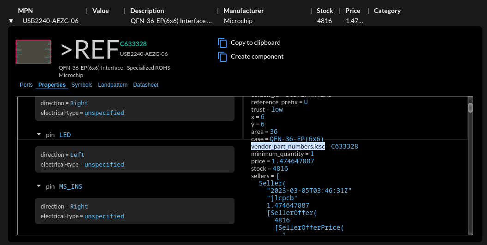
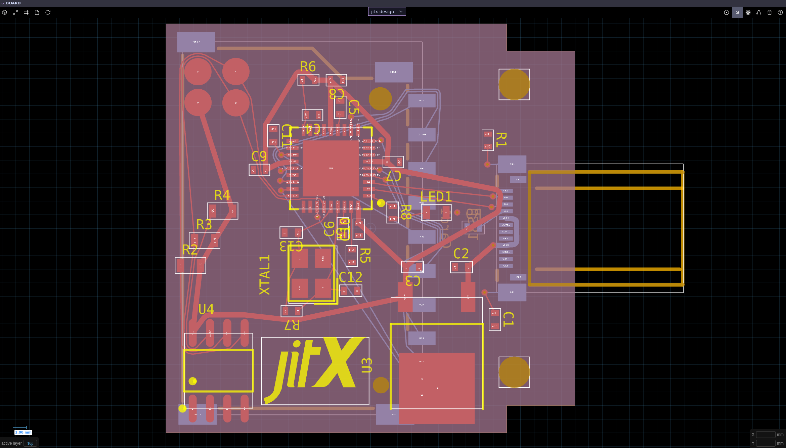
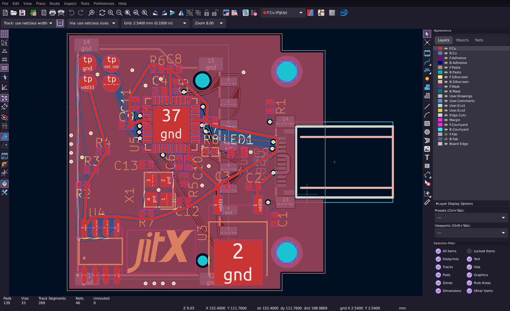
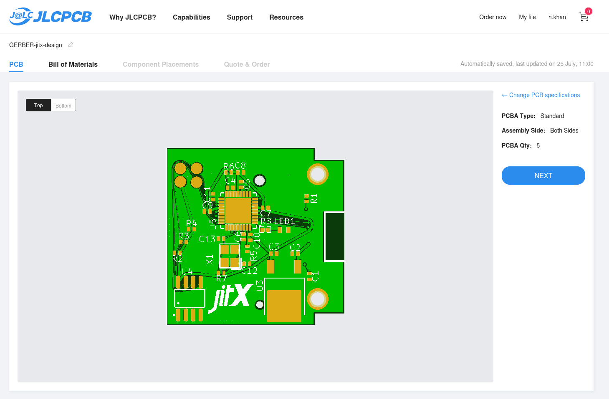

# SD Card Reader Cookbook Recipe
This tutorial guides you on creating an SD Card Reader using JITX while highlighting different features that can be used to aid users on their designs.

##  The Project
This is an SD card reader built in a small form factor, designed to fit in the framework laptop (untested).


## Getting Started
#### Prerequisites
To start, we'll need to setup JITX. We can follow this tutorial to get setup: https://docs-testing.jitx.com/faq/installationinstructions.html

Then, we need to create a new project. So let's run VSCode, select the JITX extension, and click "New Project".

Now we're ready to start designing the board.

> NOTE: The code below is not the entire design. Refer to the [Github repo](https://github.com/JITx-Inc/jitx-cookbook/tree/main/sd_card_reader) for a full working design. Below, we describe the design flow and thought process behind designing this board.

#### Intended Functionality
We want our design to be able to:

* Read and write from an SD Card
* Interface with a computer using a USB-C male connector
* Show the status of data transfer with an LED
* Enable USB device customization using an EEPROM
#### Implementation Plan
To accomplish this, we will use:

* A controller: Microchip USB2240-AEZG-06
* A power regulator: ROHM Semicon BD433M5FP-CE2
* An EEPROM: ST Microelectronics M24C04-WMN6TP
* A USB C male connector: HRO Electronics TYPE-C-31-G-03 
* An SD card connector: XUNPU SD-101 
* Miscellaneous generic components

## Components
Most of our main components (like our controller) don't exist in the OCDB so we will define these ourselves. Fortunately, we don't have to build the landpattern definitions and pin definitions as our parts exist in the parts database. 

We can look for parts using the component search. Since, we want to manufacture this board from JLCPCB, we should look for components that have the property `vendor_part_numbers.lcsc`.



We want to define each of our main components in their own separate modules so we can reuse them later on for different projects. Thus, each component is put into a `pcb-module`.

#### Microcontroller
For this project, we're going to use a Microchip USB2240. For each module we're going to follow a workflow:

* See what inputs and outputs we want and define them as pins and ports. 
    * We want to use bundles (ports) for pins that are commonly connected together. We can look for bundles in the OCDB by opening `ocdb/utils/bundles.stanza` 
```
port power : power
port i2c : i2c
port usb-in : usb-2
port sd-card-conn : sd-card-uhs-1-connector
pin LED
```
* We can also create our own bundles if they don't exist in the OCDB. `sd-card-uhs-1-connector` is an example
```
public pcb-bundle sd-card-uhs-1-connector:
  pin CMD ; Command/Response
  port power : power ; 3.3v and 2 ground pins
  pin CLK ; Clock
  port DAT : pin[4] ; Data pins (last pin also used as card detect)
  pin CD ; Card detect
  pin WP ; Write protect
```

* Instantiate the exact part we want using a database part query
    * An alternative to making a query could be searching for this part in the component search and clicking "Create component" after selecting a suitable component.
```
inst usb2240 : database-part(["manufacturer" => "Microchip", "mpn" => "USB2240-AEZG-06"])
```

* Go through the pins using the design explorer (you can find this by opening the sidebar and clicking "Explorer" under the "Views" section)
* Define each pin's properties with the help of the part's datasheet and the [JITX documentation](https://docs.jitx.com/reference/utilities/properties.html)
* Create and connect components that would be consistent for every use case for this design (pull-up resistors and decoupling capacitors etc.)
    * For this design, we always need a 24MHz crystal so we define it with the same workflow
    * `bypass-cap-strap` creates a capacitor which uses `short-trace`. The `short-trace` is a hint to the layout that we want our PCB trace to be as short as possible between both pads
    * It's best to define pins we're not using as a `no-connect` to avoid ERC errors in the design flow
    * The parameter `"_exist" => ["vendor_part_numbers.lcsc"]` allows us to specify that we require the part to have an LCSC number 

#### USB C male connector
Our application uses USB2 so we want to use the USB2 protocol over the USB-C connection. One key aspect of the backwards compatibility is to indicate device type using resistors on the CC1, CC2 pins. In this case, we need a pull-down resistor on the CC1 pin.

## Bundles
Bundles allow us to define a set of pins which are commonly used together and allow us to view the design at a higher level. Bundles also make connecting pins easy and foolproof. For example, we can create a bundle called `sd-card-uhs-1-connector` and define every pin required for an SD card. Now we can use this to connect our controller to the SD Card connector within a single `net` statement.

We can create bundles within bundles too to further simplify our code.

## Main Design 

We want to define a custom shape for our board with 5mm x 2mm notches so we create the board using a Polygon shape:
```
val board-shape = Polygon([Point(-15.0,-15.0), Point(10.0,-15.0), Point(10.0,-13.0), Point(15.0,-13.0), Point(15.0, 13.0), Point(10.0, 13.0), Point(10.0, 15.0), Point(-15.0,15.0)])
```

We also can to use this same shape for our ground copper ground planes which extend from edge to edge.
```
geom(gnd) :
    copper-pour(LayerIndex(0), isolate = 0.1, rank = 1, orphans = true) = board-shape
    copper-pour(LayerIndex(1), isolate = 0.1, rank = 1, orphans = true) = board-shape
```

Now that all our components and the board are defined, we can move on to placing and connecting our modules together. We use the `dims` function to get the dimensions of our custom board shape and use it for placement. 
```
val d = dims(board-shape)
```

Now we instantiate all our modules and also create testpoints which would allow us to update information on our EEPROM.
```
inst logo : ocdb/artwork/jitx-logo/logo(5.0)

; Call all our modules
inst usb : usb-2-on-usb-c-male
place(usb) at loc(x(d) / 2.0 + 1.1, 0.0, -270.0) on Bottom

inst reg : voltage-regulator

inst eeprom : eeprom

val testpoints = add-testpoint([eeprom.power.vdd eeprom.power.gnd eeprom.i2c.sda eeprom.i2c.scl], Testpoint-SMDPad)

inst media-controller : media-controller
place(media-controller) at loc(0.0, 0.0, 0.0) on Top

inst sd-connector : sd-connector
place(sd-connector) at loc(-5.0, 0.0, 270.0) on Bottom
```

We're reusing the LED circuit generator used in the [USB C cable tester](https://github.com/JITx-Inc/jitx-cookbook/tree/main/usb_c_cable_tester) to create our status LED. 
```
inst status-led : components/LED-maker-ROYGB/module(components/LED-maker-ROYGB/RED, property(vdd33.voltage))
```

Connecting our ports is easy now since we can net whole bundles together.
```
net (usb.usb-2.vbus reg.power-in)
net (usb.usb-2 media-controller.usb-in)

net (reg.power-out media-controller.power eeprom.power)

net (media-controller.i2c eeprom.i2c)
net (media-controller.sd-card-conn sd-connector.conn)

net (media-controller.LED status-led.in)
net (status-led.out gnd)
```

`check-design` allows us to use checks already made in the OCDB and use it for our board. 

## Layout + Order

#### Layout

With all our components and connections defined, now we can place our components where we want on the board. Then we can select single pads (`click`), extend the selection of pads (`shift+click`) or select all pads connected to the pad we first selected (press `a`) and then press `q` to route traces through those pads.



#### Export to KiCad

Now that we're happy with the layout, we can export the design straight into KiCad.

First, let's go into `helpers.stanza`, set KiCad as our CAD tool, and add a mapping so that the custom LCSC field gets exported as a component property:
```
val export-field-mapping = [
  "LCSC" => "LCSC"
  "lcsc" => "LCSC"
  "vendor_part_numbers.lcsc" => "LCSC"
]
defn export-to-cad () :
  set-paper(ANSI-A4)
  set-export-backend(`kicad)
  export-cad(export-field-mapping)
```
Then we build the project with `Ctrl + Enter`, and export with `export-design()` in our REPL (terminal), and a KiCad project is generated in the "CAD" directory.

#### Finishing touches in KiCad 

Let's open up KiCad, open the project, and open the schematic + board viewers. The first thing to do is to click the "Update PCB with changes made to schematic" button in the board view to ensure everything has synced.

Then we need to change the reference texts' silkscreen location as necessary.



#### Export from Kicad, order from JLCPCB

Install [this](https://github.com/Bouni/kicad-jlcpcb-tools) plugin in Kicad to manage your components from LCSC and generate your Gerbers, BOM, and CPL. 

Upload your design to JLCPCB and order it:



## Conclusion

We've now successfully designed a PCB using JITX. You can use this as a reference project, copying this workflow to design your own systems. To learn more, check out the other recipes in [the JITX Cookbook Recipes repo](https://github.com/JITx-Inc/jitx-cookbook) and read through the [tutorials](https://docs.jitx.com/tutorials/index.html) in the JITX docs.


