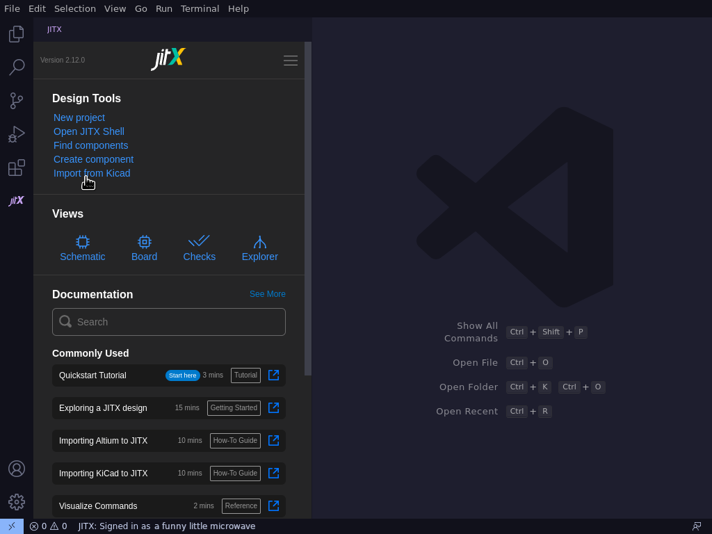
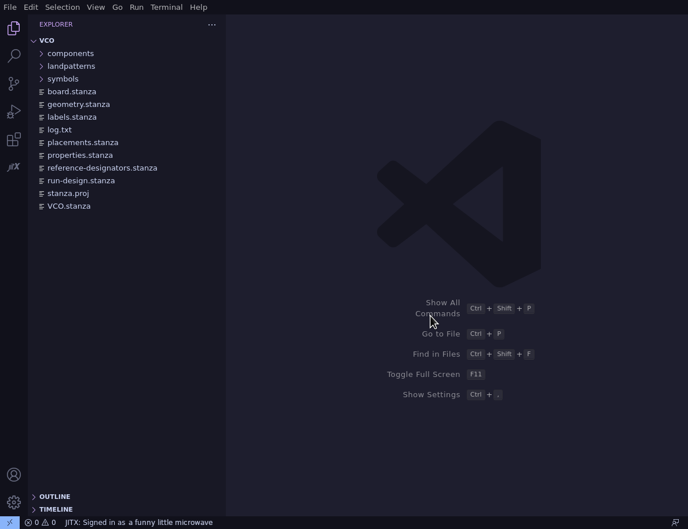
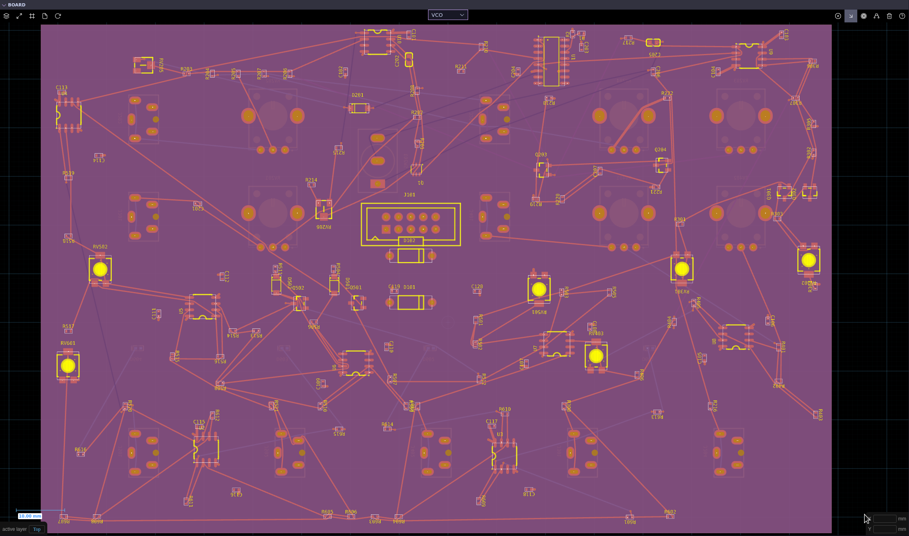
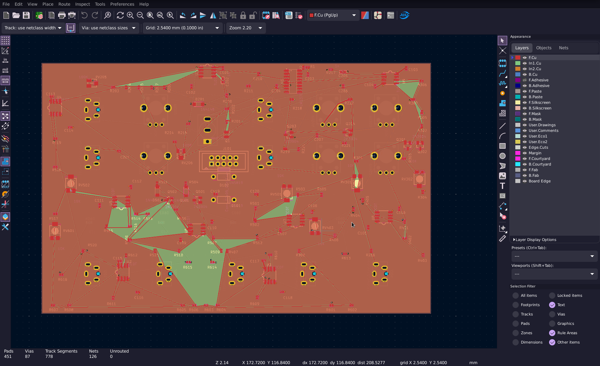
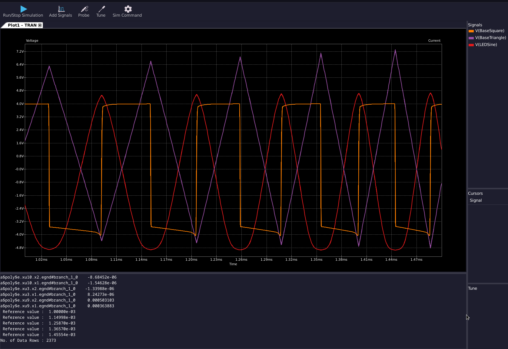

# Voltage Controlled Oscillator Recipe

This tutorial guides you on importing a project from KiCad into JITX, modifying it, and exporting it back for production.

## The Project

This is a VCO made for a modular synthesizer in the eurorack standard. The original design is from [here](https://github.com/MatthewATaylor/Modular-Synth-Hardware/tree/main/VCO)

#### General Outline

In this project, we want to:

1. Import an existing KiCad from a GitHub repository
4. Change the board stackup to 4 layers and use JLCPCB rules
2. Change most through hole components to SMD components which are available from LCSC
4. Use a matched PNP transistor pair instead of the 2k tempco resistor with 2 separate PNP transistors
2. Export the design back to KiCad and simulate the output

## Getting Started

#### Prerequisites

To start, we'll need to setup JITX. We can follow this tutorial to get setup: https://docs-testing.jitx.com/faq/installationinstructions.html

Then, we need to clone the repo from which we're importing the design. We'll do this by running:
```
git clone https://github.com/MatthewATaylor/Modular-Synth-Hardware
```

Now we want to create a folder in which we'll have our JITX files. This can be done by using your operating system's file explorer.

#### Importing the design

First, let's open VSCode and make sure that no project is open. If there's a project open then we can start with no project by going to `File -> New Window` or using the keyboard shortcut `Ctrl+Shift+N`.

Next we open the JITX sidebar by clicking the small JITX logo to the side and then clicking "Import from Kicad"



Then we navigate to the folder where we cloned the repo to import from and then to the folder `VCO`. Delete the `Panel` folder or move it somewhere else since we currently don't want to import that project. Now select `VCO` and click `Choose as input directory`.

Select the new folder we made as the output directory. If the import was successful, your VSCode window should look like this:



The files generated are as follows:

```text
.
├── board.stanza                    The definition of the board shape, stackup, and rules
├── components                      Automatically generated component files for each unique component on the board
│   └── UNKNOWN
│       └── ... 
├── geometry.stanza                 The definition of each of the copper-filled layers and traces made previously on the board 
├── labels.stanza                   The silkscreens of components and their location
├── landpatterns                    The landpatterns of automatically generated components
│   └── ...
├── log.txt                         The log containing errors and warnings during the import process
├── placements.stanza               Contains the fixed location at which each component is placed
├── properties.stanza               Contains properties automatically generated for each component
├── reference-designators.stanza    Contains the name of each component as shown on the board
├── run-design.stanza               Helper functions to build, check, and export the design
├── stanza.proj                     Contains the locations of libraries that are imported into the project
├── symbols                         Contains the symbols used for the schematic
│   └── ... 
└── VCO.stanza                      Main file containing the instantiation of components and their connections
```

## Main Design

First, we want to remove the existing trace geometry since we want to make our own using the autorouter. We can do this by removing or commenting out the following line in `VCO.stanza`:
```
add-main-geometry()
```

Let's also define our 4 copper layers, the current stackup is:
```text
==GND==
==+12==
==-12==
==GND==
```
We have +12V and -12V as nets since we're receiving a bipolar power supply.

We also want to increase the size of our power traces so we will make a `NetClass` for that.

Now, we want to change our stackup and rules. We'll go to `board.stanza` and change the stackup to a 4 layer board from JLCPCB which is available in the OCDB.

We want a larger default trace too so we can copy the JLCPCB rules from `ocdb/manufacturers/rules.stanza` and change `min-copper-width` to `0.25`

In `run-design.stanza`, change `export-design()` to `compile-design(main)` so that when we run `ctrl+enter` inside, we can view the board and schematic

#### Replacing passive components

Next, we want to change out our generic components to something available from LCSC which is also an SMD component. We'll move to `VCO.stanza` and switch out our resistors and capacitors. We don't have to explicitly define values for each component and instead we can take the value from the `emodel` (electrical model) of our component. Here we made 2 functions to convert our components with emodels to resistors or capacitors:
```
public defn emodel2resistor (component:Instantiable -- extraparams:Tuple = []) :
  chip-resistor(to-tuple(cat(["resistance" => resistance(emodel?(component) as Resistor) as Double], extraparams)))

public defn emodel2capacitor (component:Instantiable -- extraparams:Tuple = []) :
  ceramic-cap(to-tuple(cat(["capacitance" =>capacitance(emodel?(component) as Capacitor) as Double], extraparams)))
```

Now we can change all the instantiations of resistors with a well written find-and-replace command (`ctrl+h`):
```
Find: VCO/components/UNKNOWN/R(-?[0-9]*)/component
Replace: emodel2resistor(VCO/components/UNKNOWN/R$1/component, extraparams = ["_exist" => ["vendor_part_numbers.lcsc"]])
```
Don't forget to turn on regular expressions using `alt+r`

Since these resistors are not 0 indexed, we have to change the net statements to use p[2] instead of p[0]. This can be done again with find-and-replace.
```
Find: R(-?[0-9]*).p\[0\]
Replace: R$1.p[2]
```

The same can be done with capacitors

Some of our capacitors are better as film capacitors since they are less microphonic and more linear so we will replace those with film capacitors from a database part query
```
public inst jitx-C-3 :  database-part(["mpn" => "ECHU1C102GX5", "manufacturer" => "Panasonic"])
```

#### Replacing other components

Instead of the 2 2n3906 transistors and 2k tempco resistor used, we want to use a matched PNP pair. Thus, we will remove the instantiations in `VCO.stanza` (the tempco is R-64), placements in `placements.stanza`, reference designators in `reference-designators.stanza`, and `ref-labels` and `value-labels` in `labels.stanza`

Then we can instantiate the matched pair (we're using an mmdt3906) using the database part query and change the original 2n3906 pins to mmdt3906 pins. The tempco resistor's net statements should be removed.
```
public inst mmdt3906 : database-part(["mpn" => "MMDT3906", "manufacturer" => "Jiangsu Changjing Electronics Technology Co., Ltd."])
```

Now we can change the rest of the components to part queries. Components can be found using the Component Search available in JITX. This can be found by going to the JITX sidebar and clicking "Explorer".

It's best to find components that have the same or similar pin names as the names don't have to be replaced in the nets. Alternatively, you can change the component definition by clicking on a component definition while holding `ctrl`, and changing the `pcb-component` to a `pcb-module` and use that format. 

Before:
```
public pcb-component component :
  datasheet = "http://www.ti.com/lit/ds/symlink/tl071.pdf"
  pin-properties :
    [pin:Ref | pads:Ref ... | side:Dir | bank:Ref | electrical-type:String]
    [p[0] | p[1] | Right | A | "Output"]
    [p-[0] | p[2] | Left | A | "Input"]
    [p+[0] | p[3] | Left | A | "Input"]
    [p+[1] | p[5] | Left | B | "Input"]
    [p-[1] | p[6] | Left | B | "Input"]
    [p[1] | p[7] | Right | B | "Output"]
    [V- | p[4] | Down | C | "PowerIn"]
    [V+ | p[8] | Up | C | "PowerIn"]

  assign-landpattern(VCO/landpatterns/DIP-8_W762mm_Socket/DIP-8_W762mm_Socket)
  assign-symbols([
    Ref("A") => TL072A
    Ref("B") => TL072B
    Ref("C") => TL072C
  ])
```

After:
```
public pcb-module component :
  port p : pin[2]
  port p- : pin[2]
  port p+ : pin[2]
  pin V-
  pin V+

  val datasheet = "http://www.ti.com/lit/ds/symlink/tl071.pdf"

  inst tl072 : database-part(["mpn" => "TL072CDT", "manufacturer" => "STMicroelectronics"])

  net (p[0] tl072.P_1OUT)
  net (p[1] tl072.P_2OUT)
  net (p-[0] tl072.P_1IN-)
  net (p-[1] tl072.P_2IN-)
  net (p+[0] tl072.P_1IN+)
  net (p+[1] tl072.P_2IN+)
  net (V- tl072.VCC-)
  net (V+ tl072.VCC+)
```

Note that you need to delete the reference designator for this component in `reference-designators.stanza` after doing this or explicitly choosing the instantiation in the `pcb-module` (`self.TL072-1.tl072` for example). The placement is also lost this way.

## Layout + Order

#### Layout
With all our components and connections defined, now we can place our components where we want on the board. Then we can select pads (`shift+click`) or select whole pads (press `a`) and then press `q` to route traces through those pads. We can use vias where necessary by pressing `v` and then dragging from a pad.

If components are out of place, then change the location and orientation in `placements.stanza` or remove their placement and move them by dragging them around. Components can be rotated by pressing `r`. Note that component placements can't be changed if they're explicitly defined.



#### Export to KiCad

Now that we're happy with the layout, we can export the design straight into KiCad.

First, let's go into `helpers.stanza`, set KiCad as our CAD tool, and add a mapping so that the custom LCSC field get's exported with our components:
```
val export-field-mapping = [
  "LCSC" => "LCSC"
  "lcsc" => "LCSC"
  "vendor_part_numbers.lcsc" => "LCSC"
]
defn export-to-cad () :
  set-paper(ANSI-A4)
  set-export-backend(`kicad)
  export-cad(export-field-mapping)
```
Then we build the project with `Ctrl + Enter`, and export with `export-design()` in our REPL (terminal), and a KiCad project is generated in the "CAD" directory.

#### Finishing touches in KiCad 

Let's open up KiCad, open the project, and open the schematic + board viewers. The first thing to do is to click the "Update PCB with changes made to schematic" button in the board view to ensure everything has synced.

Then, change the silkscreen position and add vias as deemed necessary.



A SPICE simulation can also be done in the schematic viewer of KiCad to test the circuit (this requires some setting up).



## Conclusion

We've now successfully imported and redesigned a PCB using JITX. You can use this as a reference project, copying this workflow to design your own systems. To learn more, check out the other recipes in [the JITX Cookbook Recipes repo](https://github.com/JITx-Inc/jitx-cookbook) and read through the [tutorials](https://docs.jitx.com/tutorials/index.html) in the JITX docs.
